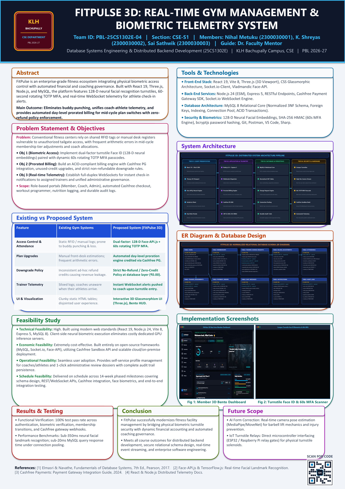
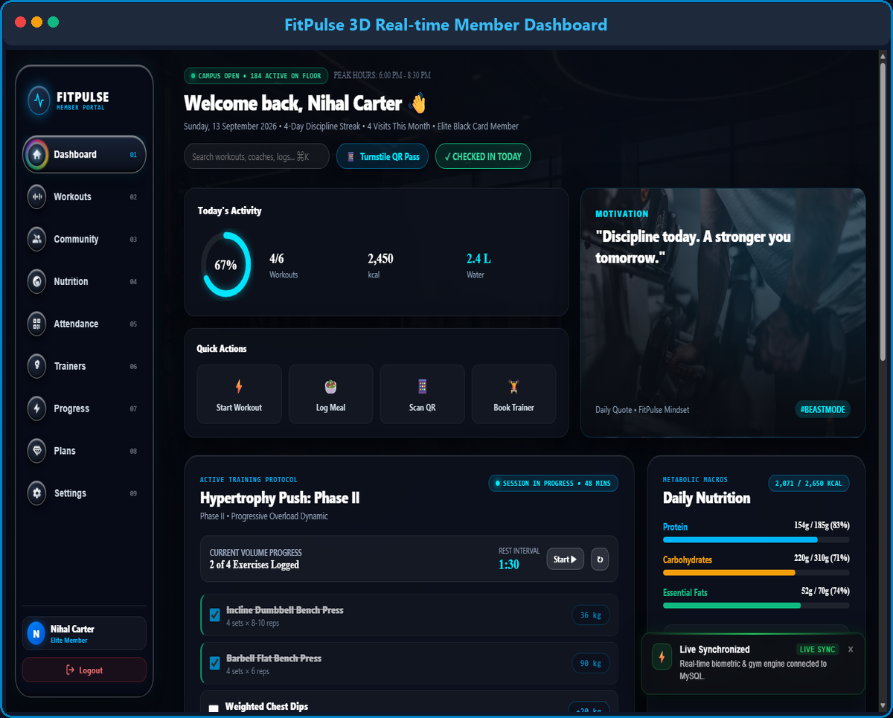
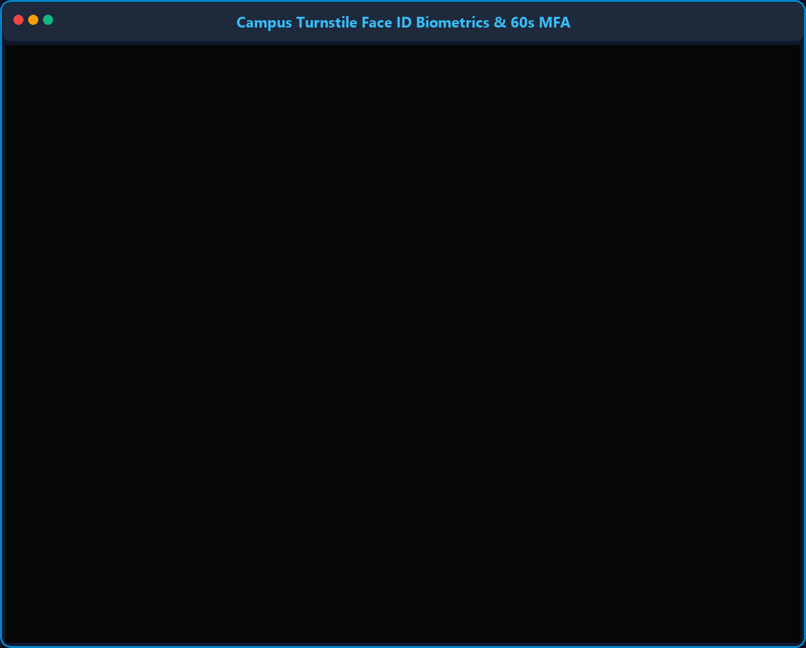

# FitPulse 3D: Real-Time Gym Management & Biometric Telemetry System

[](https://react.dev/)
[](https://vitejs.dev/)
[](https://nodejs.org/)
[](https://expressjs.com/)
[](https://www.mysql.com/)
[](https://threejs.org/)
[](https://www.cashfree.com/)
[](https://socket.io/)

---

## 🏛️ Academic Coursework Context

* **Institution:** KL University (KLH Bachupally Campus)
* **Department:** Department of Computer Science & Engineering
* **Course:** Database Systems Engineering & Distributed Backend Development (**25CS1302E**)
* **Program:** Project-Based Learning (PBL) 2026–27
* **Team ID:** `PBL-25CS1302E-04` | **Section:** `CSE-S1`
* **Team Members:**
  * **Nihal Metuku** (`2300030001`)
  * **K. Shreyas** (`2300030002`)
  * **Sai Sathwik** (`2300030003`)
* **Project Guide:** Dr. Faculty Mentor, CSE Department

---

## 📌 Executive Summary

**FitPulse 3D** is an enterprise-grade fitness club management platform that unifies physical biometric access hardware with distributed financial and coaching telemetry. Traditional fitness platforms suffer from buddy-punching, uncoordinated coach-athlete communication, and error-prone billing arithmetic during mid-cycle plan switches.

FitPulse 3D solves these challenges through:
1. **Physical Biometric Security:** Turnstile facial recognition (128-D neural embeddings via Face-API.js) combined with dynamic 60-second rotating TOTP multi-factor authentication (HMAC SHA-256).
2. **Real-Time Telemetry:** Instant full-duplex WebSocket alerts notifying personal trainers the exact millisecond their assigned athlete scans through turnstile access.
3. **Automated Prorated Billing Engine:** An ACID-compliant financial engine integrated with Cashfree PG that calculates day-level proration credits for plan upgrades while enforcing a strict zero-refund policy for plan downgrades.
4. **Interactive 3D Glassmorphic Interface:** High-fidelity 3D viewport rendered using Three.js alongside a responsive Bento Grid HUD.

---

## 📸 System Previews

### PBL Research Project Poster


### Core System Dashboards
| Member 3D Bento Dashboard | Turnstile Face ID Biometrics & 60s MFA |
| :---: | :---: |
|  |  |

---

## 🏗️ 4-Tier Distributed System Architecture

```
┌─────────────────────────────────────────────────────────────────────────────┐
│                        TIER 1: CLIENT PRESENTATION                          │
│   • React 19 + Vite 8 SPA           • Three.js 3D Interactive Viewport      │
│   • Bento Grid Glassmorphic HUD     • Client-side Face-API.js Neural Engine │
│   • Socket.io-Client Telemetry      • Role Portals (Member / Coach / Admin) │
└──────────────────────────────────────┬──────────────────────────────────────┘
                                       │ RESTful APIs / WebSocket WSS
┌──────────────────────────────────────▼──────────────────────────────────────┐
│                    TIER 2: APPLICATION & TELEMETRY ENGINE                   │
│   • Node.js 24 (ESM) + Express 5     • WebSocket Telemetry Event Bus         │
│   • JWT Auth & SHA-256 HMAC Engine  • Prorated Billing Engine (Day-Level)   │
│   • Cashfree Payment Gateway SDK     • Audit Logging & Security Middleware   │
└──────────────────────────────────────┬──────────────────────────────────────┘
                                       │ Connection Pool (ACID Transactions)
┌──────────────────────────────────────▼──────────────────────────────────────┐
│                   TIER 3: DATABASE & PERSISTENCE LAYER                      │
│   • MySQL 8 Relational Database (Normalized 3NF Schema)                     │
│   • Users, Memberships, Trainer Assignments, Change Requests, Attendance    │
│   • Billing Adjustments, Payment Orders, Chat Messages, Notifications, Logs │
└──────────────────────────────────────┬──────────────────────────────────────┘
                                       │ Hardware Trigger Relays & Scanner Feeds
┌──────────────────────────────────────▼──────────────────────────────────────┐
│                     TIER 4: SECURITY & HARDWARE ACCESS                      │
│   • Campus Turnstile Gate Relays    • High-Resolution Live Camera Feeds    │
│   • 60s Rotating Dynamic MFA Token  • Cashfree Sandbox Payment Webhooks     │
└─────────────────────────────────────────────────────────────────────────────┘
```

---

## 📊 Normalized Relational Database Design (3NF)

The database schema is structured into 10 relational entities enforcing strict foreign keys, indexing, and transactional integrity:

```
┌──────────────┐       ┌──────────────────────┐       ┌────────────────────────┐
│    USERS     │───1:N─│     MEMBERSHIPS      │───1:N─│  BILLING_ADJUSTMENTS   │
└──────┬───────┘       └──────────────────────┘       └────────────────────────┘
       │
       ├───1:N─── ┌──────────────────────┐            ┌────────────────────────┐
       │          │ TRAINER_ASSIGNMENTS  │──────1:N───│ TRAINER_CHANGE_REQUESTS│
       │          └──────────────────────┘            └────────────────────────┘
       │
       ├───1:N─── ┌──────────────────────┐            ┌────────────────────────┐
       │          │      ATTENDANCE      │            │     PAYMENT_ORDERS     │
       │          └──────────────────────┘            └────────────────────────┘
       │
       ├───1:N─── ┌──────────────────────┐            ┌────────────────────────┐
       │          │    CHAT_MESSAGES     │            │     NOTIFICATIONS      │
       │          └──────────────────────┘            └────────────────────────┘
       │
       └───1:N─── ┌──────────────────────┐
                  │      AUDIT_LOGS      │
                  └──────────────────────┘
```

### Key Relational Tables:
- `users`: Core authentication identity, role enum (`member`, `trainer`, `admin`), profile picture, trainer rate.
- `memberships`: Plan duration (`1M`, `3M`, `6M`, `1Y`), status (`Active`, `Expired`), renewal timestamps.
- `trainer_assignments`: Active and historical member-to-coach 1:1 bindings.
- `trainer_change_requests`: Member requests to switch coaches, approval states, and trainer rate delta adjustments.
- `billing_adjustments`: Day-level proration ledger tracking credit adjustments and cash adjustments.
- `attendance`: Biometric turnstile logs (`Face_ID`, `MFA`, `Manual`), confidence ratings, and hardware trigger timestamps.
- `payment_orders`: Cashfree PG order token bindings, payment status (`PENDING`, `PAID`, `FAILED`), and webhook signatures.
- `chat_messages`: Real-time coach-athlete communication ledger.
- `notifications`: Push and in-app alerts for attendance, payments, and administrative actions.
- `audit_logs`: Immutable security audit trail with IP address and JSON action payload snapshot.

---

## ⚡ Feature Matrix: Existing vs. FitPulse 3D

| Capability | Conventional Gym Platforms | FitPulse 3D Gym Management System |
| :--- | :--- | :--- |
| **Access Control** | Static RFID or paper desk logs; high buddy-punching rate | **Dual-Factor:** 128-D Face-API.js + 60s rotating TOTP MFA |
| **Plan Upgrades** | Manual front-desk guesswork; frequent math discrepancies | **Automated Day-Level Proration:** Unused days credited instantly via Cashfree PG |
| **Downgrade Policy**| Inconsistent ad-hoc refunds causing revenue leaks | **Strict Zero-Refund Policy:** Database enforcement guarantees non-refundable delta (₹0.00) |
| **Coach Telemetry** | Siloed records; trainers unaware of athlete arrival | **Real-Time WebSocket Alerts:** Coach HUD notified the second athlete checks in |
| **User Experience** | Clunky legacy tables and disjointed pages | **3D Glassmorphism UI:** Three.js interactive canvas with responsive Bento Grid HUD |
| **Mobile Access** | Web-only or unresponsive mobile web pages | **Capacitor Mobile App:** Native Android build with fast touch-optimized interfaces |

---

## 🚀 Getting Started & Local Development

### 1. Prerequisites
- **Node.js**: v18.0.0 or higher (Node.js 20+ / 24 recommended)
- **npm**: v9.0.0+
- **MySQL Server**: v8.0+

### 2. Clone the Repository
```bash
git clone https://github.com/amulyaalluru2007-ctrl/DSE_DBD_Gym_and_Fitness_Club_Management_System.git
cd DSE_DBD_Gym_and_Fitness_Club_Management_System
```

### 3. Environment Configuration
Create a `.env` file in the root directory (based on `.env.example`):
```env
PORT=5000
DB_HOST=localhost
DB_USER=root
DB_PASSWORD=your_mysql_password
DB_NAME=fitpulse_gym
DB_PORT=3306

JWT_SECRET=your_jwt_secret_key_here
CLIENT_URL=http://localhost:5173

# Cashfree Sandbox Credentials
CASHFREE_APP_ID=your_cashfree_app_id
CASHFREE_SECRET_KEY=your_cashfree_secret_key
CASHFREE_ENV=sandbox
CASHFREE_API_VERSION=2023-08-01
```

### 4. Database Setup
Log in to MySQL and initialize the schema:
```sql
CREATE DATABASE fitpulse_gym;
USE fitpulse_gym;
SOURCE server/schema.sql;
```

### 5. Install Dependencies & Launch
In the root directory, start both the client and server:

```bash
# Install dependencies
npm install

# Start Backend Server (Port 5000)
node server/server.js

# In a separate terminal, start Vite Frontend (Port 5173)
npm run dev
```

Visit `http://localhost:5173` to access the application.

---

## 📁 Repository Structure

```
├── docs/                                # Documentation, diagrams & showcase captures
│   └── screenshots/                     # Android, mobile & desktop HUD captures
├── public/                              # Static assets, 3D frames & Face-API neural models
│   ├── frames/                          # Compressed WebP hero animation frames
│   ├── models/                          # Face-API.js neural weights & manifests
│   └── videos/                          # Transition & walkthrough media
├── server/                              # Distributed Backend Engine
│   ├── config/                          # MySQL connection pool & Cashfree setup
│   ├── controllers/                     # Auth, attendance, billing & telemetry logic
│   ├── routes/                          # RESTful API route definitions
│   ├── schema.sql                       # 3NF relational database schema DDL
│   └── server.js                        # Express server entry point & WebSocket server
├── src/                                 # React 19 Frontend Application
│   ├── components/                      # Bento cards, 3D stages, modals, turnstile HUD
│   ├── pages/                           # Member, Trainer, Admin, Attendance & Auth pages
│   ├── services/                        # WebSocket telemetry & REST API clients
│   └── styles/                          # Glassmorphic responsive stylesheet system
├── mobile-app/                          # Capacitor Android mobile client
├── architecture_diagram.png             # 4-Tier Distributed Architecture Diagram
├── er_diagram.png                       # Normalized Relational ER Diagram (3NF)
├── PBL_Project_Poster_Filled.pptx       # Editable A3 Project Poster Presentation
├── PBL_Project_Poster_Filled.pdf        # Print-ready Vector Project Poster PDF
├── PROJECT REVIEW 1.pptx                # Project Review 1 Presentation
├── Project abstract submission Template.docx # Abstract submission dossier
├── package.json                         # Workspace dependencies & run scripts
└── vite.config.js                       # Vite bundler configuration
```

---

## 📄 Academic Project Deliverables

* 📊 **Poster Presentation (PPTX):** [`PBL_Project_Poster_Filled.pptx`](PBL_Project_Poster_Filled.pptx)
* 📑 **Poster Print Document (PDF):** [`PBL_Project_Poster_Filled.pdf`](PBL_Project_Poster_Filled.pdf)
* 🖼️ **High-Resolution Poster Preview:** [`poster_preview.png`](poster_preview.png)
* 📋 **Project Review 1 Slides:** [`PROJECT REVIEW 1.pptx`](PROJECT REVIEW 1.pptx)
* 📝 **Project Abstract Submission:** [`Project abstract submission Template.docx`](Project abstract submission Template.docx)

---

## 📜 License & Compliance

Developed as part of the academic curriculum for **25CS1302E: Database Systems Engineering and Distributed Backend Development** at **KL University Bachupally Campus**. All rights reserved © 2026–27.
