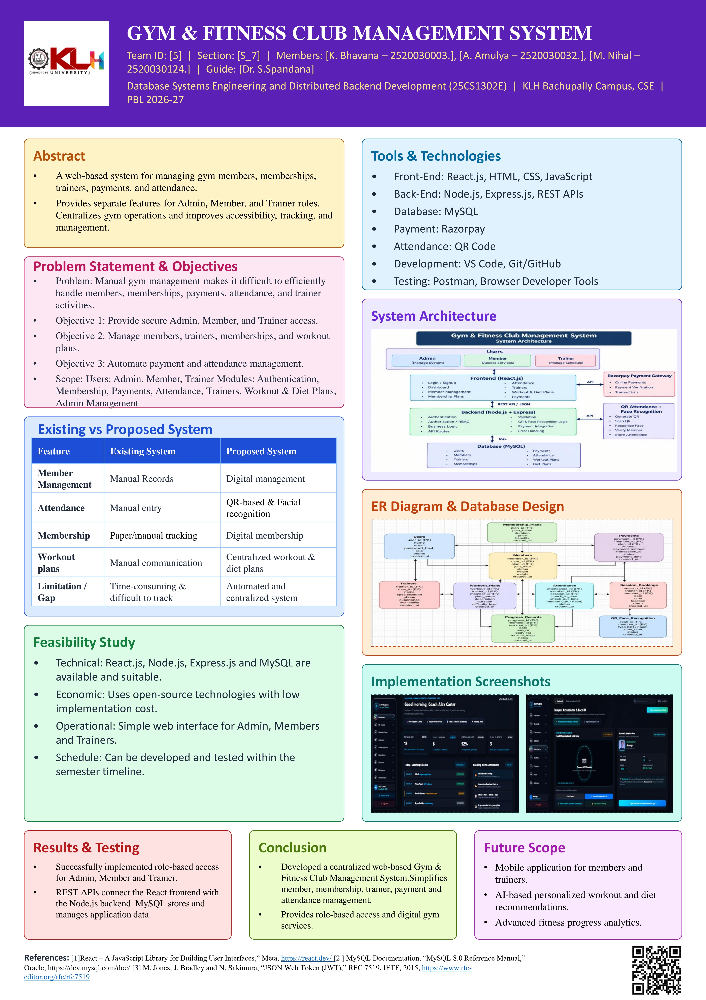

# Gym & Fitness Club Management System (FitPulse 3D)

[](https://kluniversity.in)
[](https://kluniversity.in)
[](https://kluniversity.in)
[](#team-information)

---

## 🏛️ Academic Coursework Information

* **Course Name:** Database Systems Engineering and Distributed Backend Development (**25CS1302E**)
* **Program:** Project-Based Learning (PBL), Academic Year 2026–27
* **Department:** Department of Computer Science and Engineering (CSE)
* **Institution:** KL University (KLH Bachupally Campus)
* **Group Number:** **5**
* **Section:** **S_7**
* **Project Guide:** **Dr. S. Spandana**, Assistant Professor, Department of Computer Science & Engineering

### 👥 Team Members

| Roll Number | Student Name | Role |
| :--- | :--- | :--- |
| **2520030003** | **K. Bhavana** | Core Team Member |
| **2520030032** | **A. Amulya** | Core Team Member |
| **2520030124** | **M. Nihal** | Core Team Member |

---

## 📑 Academic Project Deliverables & Submission Dossier

All official university evaluation submissions are organized directly at the root of this repository:

| Deliverable | Format | File Link |
| :--- | :---: | :--- |
| **Project Research Poster (Editable PPTX)** | `.pptx` | [**`PBL_Project_Poster.pptx`**](PBL_Project_Poster.pptx) |
| **Project Research Poster (Print Vector PDF)** | `.pdf` | [**`PBL_Project_Poster.pdf`**](PBL_Project_Poster.pdf) |
| **Project Research Poster (High-Res Image)** | `.jpg` | [**`PBL_Project_Poster.jpg`**](PBL_Project_Poster.jpg) |
| **Project Review 1 Presentation Slides** | `.pptx` | [**`PROJECT REVIEW 1.pptx`**](PROJECT%20REVIEW%201.pptx) |
| **Project Abstract Submission Template** | `.docx` | [**`Project abstract submission Template.docx`**](Project%20abstract%20submission%20Template.docx) |

---

## 🖼️ PBL Project Poster Preview

<p align="center">
  
</p>

---

## 💻 Source Code Directory

The complete full-stack implementation of the platform is neatly housed in the dedicated project directory:

📂 [**`fitpulse-gym/`**](fitpulse-gym/)
* 🌐 **Frontend (`fitpulse-gym/src/`):** React 19, Three.js 3D Viewport, Bento Glassmorphic HUD, Face-API Biometrics, Member/Trainer/Admin Dashboards.
* ⚙️ **Backend (`fitpulse-gym/server/`):** Node.js 24 (ESM), Express 5, WebSocket Live Telemetry, Cashfree/Payment Engine, JWT & 60s TOTP MFA.
* 🗄️ **Database (`fitpulse-gym/server/schema.sql`):** Normalized 3NF MySQL relational database schema.
* 📱 **Mobile Client (`fitpulse-gym/mobile-app/`):** Capacitor Android mobile application.

---

## 🚀 Quick Start Guide

To run the complete system locally:

```bash
# 1. Navigate to the project directory
cd fitpulse-gym

# 2. Install dependencies
npm install

# 3. Configure environment variables
# Copy .env.example to .env and configure your MySQL database credentials
cp .env.example .env

# 4. Start the backend server (Port 5000)
node server/server.js

# 5. In a second terminal, launch the frontend (Port 5173)
npm run dev
```

Visit **`http://localhost:5173`** to access the application.

---

## 📜 Compliance & License

Developed for academic submission under the Department of Computer Science & Engineering, KL University Bachupally Campus. © 2026–27 Group 5.
